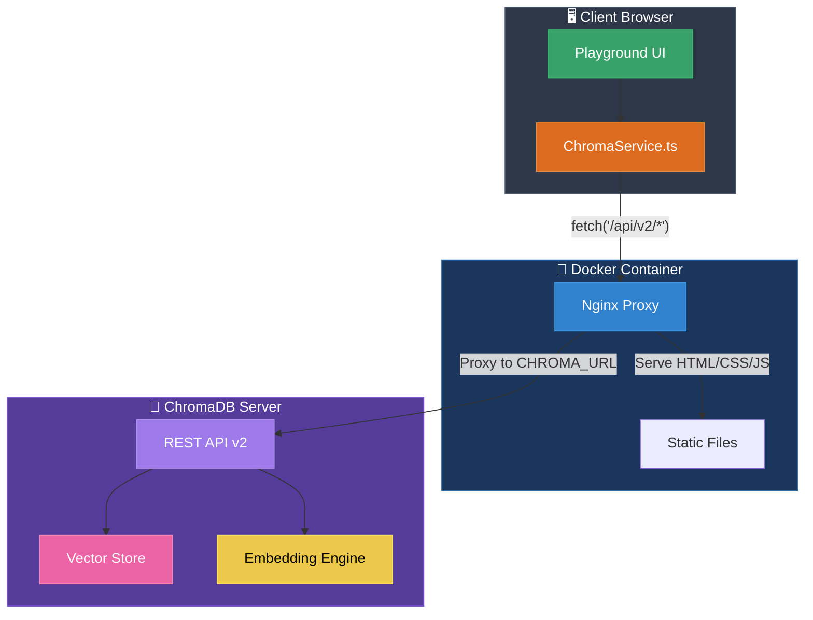
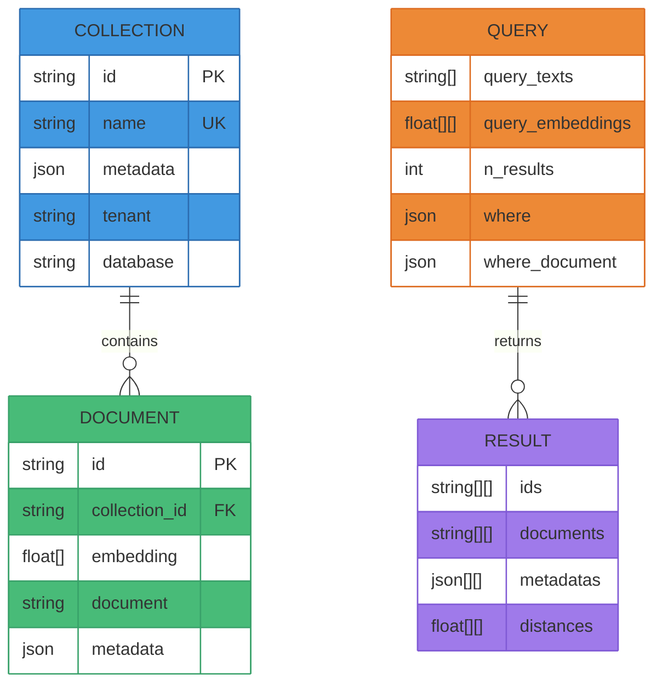

# ChromaDB Playground 기술 문서

## 1. 개요

**ChromaDB Playground**는 ChromaDB 벡터 데이터베이스의 모든 REST API v2를 인터랙티브하게 테스트할 수 있는 웹 기반 도구입니다. RAG(Retrieval-Augmented Generation) 파이프라인을 구축하는 개발자, 데이터 분석가, AI 엔지니어가 ChromaDB의 기능을 빠르게 학습하고 검증할 수 있도록 설계되었습니다.

### 주요 특징

| 특징 | 설명 |
|------|------|
| **인터랙티브 API 테스트** | 모든 ChromaDB API를 UI에서 직접 실행 |
| **실시간 응답 확인** | JSON 형식의 요청/응답을 즉시 확인 |
| **Docker 지원** | 폐쇄망 환경에서도 배포 가능 |
| **Zero Dependencies** | 브라우저 기반, 별도 설치 불필요 |
| **REST API v2** | ChromaDB 최신 API 버전 지원 |

---

## 2. 설계 아키텍처

### 2.1 시스템 구성도

```
┌─────────────────────────────────────────────────────────────┐
│                    Docker Container                         │
│  ┌───────────────────────────────────────────────────────┐  │
│  │           Frontend (Vite + TypeScript)                │  │
│  │  • 정적 HTML/CSS/JS                                   │  │
│  │  • ChromaDB REST API 호출                             │  │
│  │  • 결과 시각화                                        │  │
│  └───────────────────────────────────────────────────────┘  │
│                          │                                   │
│                          ▼                                   │
│  ┌───────────────────────────────────────────────────────┐  │
│  │              Nginx Reverse Proxy                      │  │
│  │  • /api/* → ${CHROMA_URL}/api/*                       │  │
│  │  • CORS 헤더 추가                                     │  │
│  │  • 정적 파일 서빙                                     │  │
│  └───────────────────────────────────────────────────────┘  │
└─────────────────────────────│───────────────────────────────┘
                              │
                              ▼
┌─────────────────────────────────────────────────────────────┐
│                  ChromaDB Server (외부)                     │
│  • 벡터 저장소                                              │
│  • 임베딩 관리                                              │
│  • 유사도 검색                                              │
└─────────────────────────────────────────────────────────────┘
```

### 2.2 기술 스택

| 계층 | 기술 | 역할 |
|------|------|------|
| Frontend | TypeScript, Vite | 빌드 및 개발 환경 |
| UI | Vanilla CSS | 다크 테마 UI 컴포넌트 |
| State | Custom Store | 상태 관리 |
| Proxy | Nginx | API 프록시 및 정적 파일 서빙 |
| Container | Docker | 배포 및 격리 |

---

## 3. 주요 기능 설명

### 3.1 Client API

| API | 메서드 | 설명 | 사용 시나리오 |
|-----|--------|------|---------------|
| `heartbeat` | GET | 서버 연결 상태 확인 | 헬스체크, 모니터링 |
| `version` | GET | ChromaDB 버전 조회 | 호환성 확인 |
| `reset` | POST | 전체 데이터베이스 초기화 | 테스트 환경 리셋 |
| `listCollections` | GET | 컬렉션 목록 조회 | 데이터 탐색 |
| `countCollections` | GET | 컬렉션 수 조회 | 통계 확인 |

### 3.2 Collection 관리 API

| API | 메서드 | 설명 | 파라미터 |
|-----|--------|------|----------|
| `createCollection` | POST | 새 컬렉션 생성 | name, metadata |
| `getCollection` | GET | 특정 컬렉션 조회 | name |
| `getOrCreateCollection` | POST | 컬렉션 조회 또는 생성 | name, metadata |
| `deleteCollection` | DELETE | 컬렉션 삭제 | name |

### 3.3 Collection 작업 API

| API | 메서드 | 설명 | 주요 파라미터 |
|-----|--------|------|---------------|
| `add` | POST | 문서/임베딩 추가 | ids, documents, embeddings, metadatas |
| `upsert` | POST | 추가 또는 업데이트 | ids, documents, embeddings, metadatas |
| `get` | POST | 문서 조회 | ids, where, limit, include |
| `query` | POST | 유사도 검색 | query_texts, n_results, where, include |
| `update` | POST | 문서 업데이트 | ids, documents, embeddings, metadatas |
| `delete` | POST | 문서 삭제 | ids, where |
| `peek` | POST | 샘플 데이터 미리보기 | limit |
| `count` | GET | 문서 수 조회 | - |
| `modify` | PUT | 컬렉션 메타데이터 수정 | name, metadata |

---

## 4. 데이터 구조

### 4.1 Collection 구조

```json
{
  "id": "uuid-string",
  "name": "my_collection",
  "metadata": {
    "description": "RAG용 문서 저장소",
    "created_at": "2024-01-01"
  }
}
```

### 4.2 Document 구조

| 필드 | 타입 | 필수 | 설명 |
|------|------|------|------|
| `ids` | string[] | ✓ | 고유 식별자 배열 |
| `documents` | string[] | - | 원본 텍스트 (임베딩 자동 생성) |
| `embeddings` | number[][] | - | 직접 제공하는 벡터 |
| `metadatas` | object[] | - | 필터링용 메타데이터 |

### 4.3 Query 구조

```json
{
  "query_texts": ["검색할 텍스트"],
  "n_results": 5,
  "where": {"category": "tech"},
  "include": ["documents", "metadatas", "distances"]
}
```

### 4.4 Query 결과 구조

```json
{
  "ids": [["id1", "id2", "id3"]],
  "documents": [["문서1", "문서2", "문서3"]],
  "metadatas": [[{"category": "tech"}, ...]],
  "distances": [[0.1, 0.2, 0.3]]
}
```

---

## 5. Playground 인터페이스

### 5.1 화면 구성

| 영역 | 위치 | 기능 |
|------|------|------|
| **Header** | 상단 | 연결 상태 표시, 로고 |
| **Sidebar** | 좌측 | API 메서드 목록, 컬렉션 선택 |
| **Main Panel** | 중앙 | 파라미터 입력, 실행, 결과 표시 |

### 5.2 기능별 UI 요소

| 요소 | 설명 |
|------|------|
| 연결 패널 | Tenant, Database, Auth Token 설정 |
| API 선택기 | 카테고리별 API 메서드 버튼 |
| 파라미터 에디터 | JSON 형식 파라미터 입력 |
| 실행 버튼 | API 호출 실행 |
| 결과 뷰어 | 응답 JSON, 성공/실패 상태, 응답 시간 |

---

## 6. 사용 흐름 (Flow)

### 6.1 기본 사용 흐름

1. **ChromaDB 서버 실행**
   ```bash
   chroma run --host 0.0.0.0 --port 8000 --path ./data
   ```

2. **Playground 접속**
   - 개발 환경: `http://localhost:3000`
   - Docker: `docker run -p 3000:3000 -e CHROMA_URL=http://host.docker.internal:8000 chromadb-playground`

3. **연결 설정**
   - Tenant: `default_tenant` (기본값)
   - Database: `default_database` (기본값)
   - 연결 버튼 클릭

4. **컬렉션 생성**
   - 사이드바에서 `createCollection` 선택
   - 파라미터 입력: `{"name": "my_docs"}`
   - 실행

5. **데이터 추가**
   - 컬렉션 선택
   - `add` API 선택
   - 문서 데이터 입력 및 실행

6. **검색 수행**
   - `query` API 선택
   - 검색 쿼리 입력 및 실행
   - 결과 확인

### 6.2 Docker 배포 흐름

1. **이미지 빌드**
   ```bash
   docker build -t chromadb-playground .
   ```

2. **컨테이너 실행**
   ```bash
   docker run -p 3000:3000 \
     -e CHROMA_URL=http://chromadb-server:8000 \
     chromadb-playground
   ```

3. **접속 및 사용**
   - 브라우저에서 `http://localhost:3000` 접속

---

## 7. 실사용 예시

### 7.1 RAG 파이프라인 테스트

RAG(Retrieval-Augmented Generation) 시스템 구축 시 ChromaDB Playground를 활용한 검증 예시:

#### Step 1: 문서 컬렉션 생성

```json
// createCollection
{
  "name": "rag_documents",
  "metadata": {
    "description": "RAG용 기술 문서",
    "embedding_model": "text-embedding-ada-002"
  }
}
```

#### Step 2: 문서 추가 (임베딩 자동 생성)

```json
// add
{
  "ids": ["doc1", "doc2", "doc3"],
  "documents": [
    "ChromaDB는 오픈소스 벡터 데이터베이스입니다.",
    "RAG는 검색 증강 생성의 약자입니다.",
    "임베딩은 텍스트를 벡터로 변환하는 과정입니다."
  ],
  "metadatas": [
    {"category": "database", "source": "wiki"},
    {"category": "ai", "source": "blog"},
    {"category": "ml", "source": "docs"}
  ]
}
```

#### Step 3: 유사도 검색

```json
// query
{
  "query_texts": ["벡터 데이터베이스란 무엇인가?"],
  "n_results": 2,
  "include": ["documents", "metadatas", "distances"]
}
```

#### Step 4: 결과 확인

```json
// Response
{
  "ids": [["doc1", "doc3"]],
  "documents": [
    ["ChromaDB는 오픈소스 벡터 데이터베이스입니다.",
     "임베딩은 텍스트를 벡터로 변환하는 과정입니다."]
  ],
  "distances": [[0.12, 0.34]]
}
```

#### Step 5: LLM에 컨텍스트 전달

검색된 문서를 LLM 프롬프트에 포함:

```
Context:
- ChromaDB는 오픈소스 벡터 데이터베이스입니다.
- 임베딩은 텍스트를 벡터로 변환하는 과정입니다.

Question: 벡터 데이터베이스란 무엇인가?
```

### 7.2 필터링을 활용한 고급 검색

```json
// query with where filter
{
  "query_texts": ["AI 기술"],
  "n_results": 5,
  "where": {
    "$and": [
      {"category": {"$eq": "ai"}},
      {"source": {"$in": ["blog", "docs"]}}
    ]
  },
  "include": ["documents", "metadatas", "distances"]
}
```

---

## 8. 장점, 한계, 향후 개선 방향

### 8.1 장점

| 장점 | 설명 |
|------|------|
| **즉시 사용 가능** | 설치 없이 브라우저에서 바로 사용 |
| **학습 곡선 최소화** | 직관적인 UI로 API 학습 용이 |
| **Docker 지원** | 폐쇄망 환경에서도 배포 가능 |
| **CORS 해결** | Nginx 프록시로 브라우저 제한 우회 |
| **실시간 피드백** | 응답 시간, 성공/실패 즉시 확인 |

### 8.2 한계

| 한계 | 설명 |
|------|------|
| **대용량 데이터** | 대량의 임베딩 입력은 UI로 불편 |
| **인증 제한** | 기본 Token 인증만 지원 |
| **임베딩 함수** | 별도 임베딩 함수 설정 불가 (서버 기본값 사용) |
| **배치 처리** | 대량 배치 작업에는 적합하지 않음 |

### 8.3 향후 개선 방향

1. **파일 업로드 지원**
   - CSV, JSON 파일로 대량 데이터 추가

2. **임베딩 시각화**
   - 2D/3D 벡터 공간 시각화

3. **쿼리 히스토리**
   - 이전 쿼리 저장 및 재실행

4. **다중 컬렉션 비교**
   - 여러 컬렉션 결과 비교 뷰

5. **OpenAPI 스펙 자동 로드**
   - ChromaDB 버전에 따른 동적 API 생성

---

## 9. 아키텍처 다이어그램





---

## 10. 빠른 시작 가이드

### Docker로 실행

```bash
# 1. ChromaDB 서버 실행
docker run -p 8000:8000 chromadb/chroma

# 2. Playground 실행
docker run -p 3000:3000 \
  -e CHROMA_URL=http://host.docker.internal:8000 \
  chromadb-playground

# 3. 브라우저에서 접속
open http://localhost:3000
```

### 로컬 개발

```bash
# 1. 의존성 설치
npm install

# 2. 개발 서버 실행
npm run dev

# 3. 빌드
npm run build
```

---

## 11. 환경 변수

| 변수 | 기본값 | 설명 |
|------|--------|------|
| `CHROMA_URL` | `http://localhost:8000` | ChromaDB 서버 URL |

---

## 12. 참고 자료

- [ChromaDB 공식 문서](https://docs.trychroma.com/)
- [ChromaDB REST API v2 Spec](https://docs.trychroma.com/reference/js-client)
- [RAG 개념 소개](https://www.pinecone.io/learn/retrieval-augmented-generation/)

---

*문서 버전: 1.0.0 | 최종 업데이트: 2024-12*
